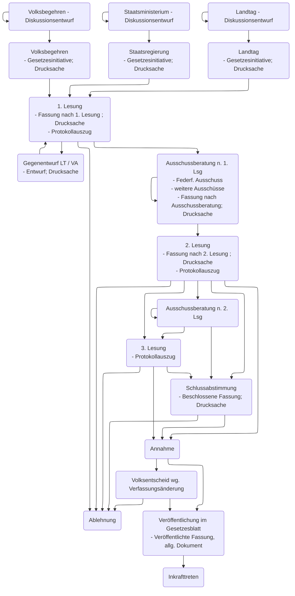

# Gesetzgebungstracks

## Bayern

```mermaid 
---
config:
  layout: elk
---
flowchart TD
%% Initiativwege
VBDKS(Volksbegehren - Diskussionsentwurf)
STMDKS(Staatsministerium - Diskussionsentwurf)
LTDKS(Landtag - Diskussionsentwurf)

%% Initiativen
INITVB(Volksbegehren
- Gesetzesinitiative; Drucksache)
INITSR(Staatsregierung
- Gesetzesinitiative; Drucksache)
INITLT(Landtag
- Gesetzesinitiative; Drucksache)
GGEW(Gegenentwurf LT / VA
- Entwurf; Drucksache)

%% Vorgang
EXIT(Ablehnung)
VV1L(1. Lesung
- Fassung nach 1. Lesung ; Drucksache
- Protokollauszug)
AUSSCH(Ausschussberatung n. 1. Lsg
- Federf. Ausschuss
- weitere Ausschüsse
- Fassung nach Ausschussberatung; Drucksache)
AUSSCH2(Ausschussberatung n. 2. Lsg)
VV2L(2. Lesung
- Fassung nach 2. Lesung ; Drucksache
- Protokollauszug)
VV3L(3. Lesung
- Protokollauszug)
SCHLABST(Schlussabstimmung
- Beschlossene Fassung; Drucksache)
ANNA(Annahme)
VEVERF(Volksentscheid wg. Verfassungsänderung)

%% Postparlamentarisch
GB(Veröffentlichung im Gesetzesblatt
- Veröffentlichte Fassung, allg. Dokument)
IK(Inkrafttreten)

%% Zusammenhang
VBDKS --> VBDKS & INITVB
STMDKS --> STMDKS & INITSR
LTDKS --> LTDKS & INITLT

INITVB & INITSR & INITLT --> VV1L
VV1L --> EXIT  & GGEW
GGEW --> VV1L
VV1L --> AUSSCH --> VV2L
AUSSCH --> AUSSCH
VV2L --> EXIT & ANNA & VV3L & AUSSCH2
AUSSCH2 --> VV3L & SCHLABST
AUSSCH2 --> AUSSCH2
VV3L --> EXIT & ANNA
VV2L & VV3L --> SCHLABST
SCHLABST --> ANNA & EXIT

ANNA --> GB & VEVERF
VEVERF --> EXIT & GB
GB --> IK
```
